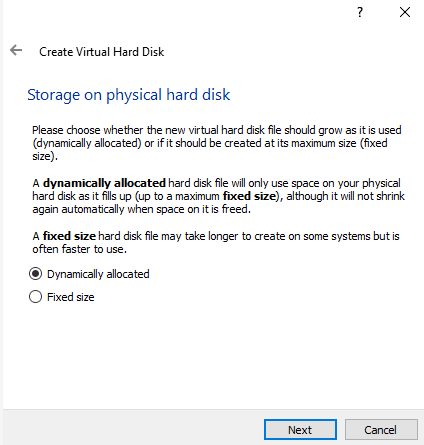
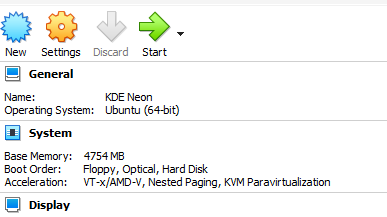
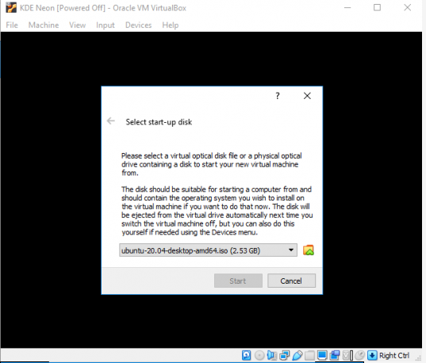

# linux-neon
Sistema operativo para el Desarrollo de una comunidad 

1. inicie Oracle VirtualBox Manager y haga clic en la opción para crear una nueva máquina virtual, Ingrese un nombre para la máquina virtual en el Nombre campo y seleccione el MáquinaCarpeta donde guardar la máquina virtual. KDE neon se basa en Ubuntu 20.04 LTS, por lo que debe seleccionar el Escribe como Linux y el Versión como Ubuntu (64 bits).

2. A continuación, seleccione el tamaño de la memoria de acceso aleatorio (RAM). El tamaño de memoria recomendado es de 1024 megabytes (MB), pero puede permitir más memoria según las especificaciones del sistema.

3. La máquina virtual KDE Neon requiere un disco duro. Para crear un disco duro para la máquina virtual KDE Neon, seleccione Crear un disco duro virtual ahora y presione Crear.

4. En la siguiente pantalla, seleccione el VDI (imagen de disco de VirtualBox) tipo de archivo de disco duro y haga clic en next.

5. En la siguiente pantalla, seleccione el tipo de almacenamiento DinamicamenteAsignado y haga clic en next.

6. En la siguiente pantalla, verifique el destino y el nombre del disco duro virtual, seleccione el tamaño de archivo apropiado y haga clic en Crear.

7. Ahora, configuraremos algunos ajustes iniciales. Haga clic en el Ajustes opción para continuar.

8. En el Ajustes ventana, haga clic en el Mostrar pestaña, verifique la Permitir3DAceleración cuadro y haga clic en OK.

9. A continuación, haga clic en el Comienzo y aparecerá la siguiente ventana. Haga clic en el Escoger, agregue el ISO de neón de KDE y haga clic en Escoger.

10. Haga clic en el Comienzo y el sistema comprobará los archivos de instalación.

11. Cuando el escritorio esté cargado, presione el Instalar en pcSistema botón.

12. Seleccione el idioma preferido y haga clic en Próximo.

13. Seleccione la ubicación adecuada, es decir, región, ubicación y zona, y haga clic en Próximo.

14. En la siguiente pantalla, seleccione el TecladoDiseño, luego haga clic en Próximo.

15. Como creamos un nuevo disco duro virtual para nuestra máquina virtual KDE neon, en la pantalla de particiones, seleccionaremos Borrardisco y haga clic en Próximo.

16. Ingrese los detalles requeridos en todos los campos para crear un nuevo usuario, luego haga clic en Instalar en pc.

17. Ahora comienza la instalación.

18. Cuando se complete la instalación, presione el Hecho y se reiniciará KDE Neon.

19.  Después de que el sistema se reinicie, verá la siguiente pantalla:

